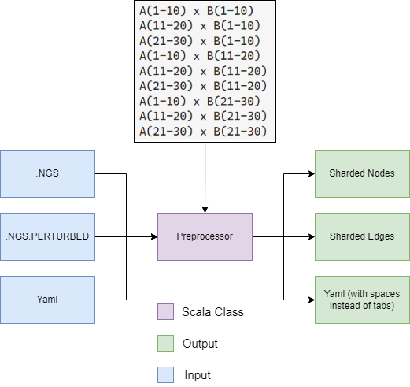
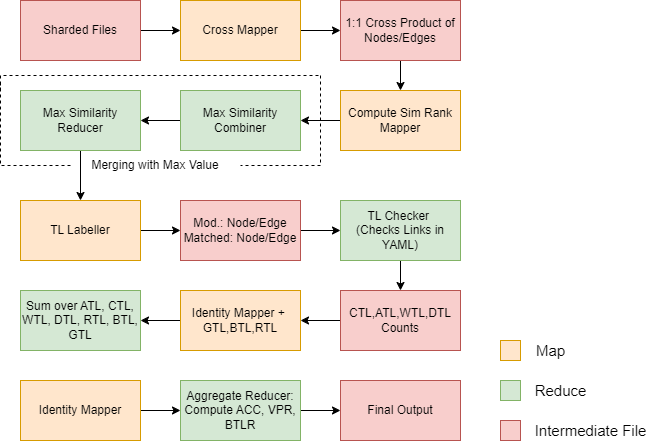

# [Kaushal Patil](@kaushal1011):  CS441 SimRankForGraphs Map Reduce

## Description


This is the implementation of an algorithm that finds traceability links in two graphs such that the other graph is a perturbed version of the original graph.
More context can be found in the [homeowork description](https://github.com/0x1DOCD00D/CS441_Fall2023/blob/main/Homework1.md). For graph generation, we use 
[NetGameSim](https://github.com/0x1DOCD00D/NetGameSim) by [Dr Mark Grechanik](@0x1DOCD00D). The algorithm is implemented in scala, it uses a preprocessing step and then 4-5 map reduce jobs to find the traceability links and output the required stats as mentioned in the homework description. 

### Preprocessing



### Map Reduce Jobs



## Algorithm

The program works in 5 phases as follows:

- Phase 1: Preprocessing(String encoding nodes and edges to a comparableNode/Edge format), Sharding and Cross Product of Shards to prepare the input for the next phase. 
  - Run: netgamesim to generate graph, preprocessor (check git submodule, instruction to run given below) to generate shard files for both nodes and edges.
- Phase 2: Cross Product of Shards to prepare the input for the next phase. The output of this cross product produces a file where each line is a pair of nodes from the two graphs.
  - Run: CrossProductGraphShards for both nodes and edges shard file
- Phase 3: Finds the similarity of each pair of nodes from the two graphs using a custom SimRank function designed using jaccard similarity. The output of this phase's mapper is a file where each line is a pair of nodes from the two graphs and their similarity score. The reducer which is also a combiner, finds out the maximum similarity score for each key. The output of this phase is a file which contains nodes from graph 1 as keys and their maximum sim score and nodes from graph 2 as keys and their maximum sim score.
  - Run: ComputeSimRankJob for crossed nodes, ComputeSimRankJobeEdges for crossed edges
- Phase 4: This phase deals with node labelling. We label each node from graph 1 as either matched, modified, or removed based on similarity score. We label each node from graph 2 as removed if their max sim score is below a threshold
  - Run: TLLabellerJob Mapper for nodes and edges
- Phase 5: This phase deals with computing the required metrics such as ATL,CTL,WTL,DTL,GTL,BTL,RTL,ACC,VPR,BTRL. (as described in the homework description)
  - Run: TLLabellerJob reducer for nodes and edges, SumJobForStatsBiCombine, StatCompute 


## How to run

Clone the repo and run the following commands in the root directory of the project. Recursively clone the submodule as well.

```bash
git submodule update --init --recursive
```


### Preprocessor

- run `cd preprocessor`
- run `sbt clean compile assembly` in the preprocessor directory
- copy the files generated from netgamesim to the preprocessor directory
- run `java -jar target/scala-3.2.2/PreprocessorForNGSSimRank-assembly-0.1.0-SNAPSHOT.jar <path to orignal graph ngs> <path to perturbed graph ngs> <path to output directory> <yaml file> <output shard file name>`
- upload the output nodeSharded file, edgeSharded file and the yaml file to HDFS.

### Map Reduce Jobs

- run `sbt clean compile assembly` in the root directory of the project
- run `sbt test` to run the tests

### Cross Product Graph Shard Job

- run `hadoop jar target/scala-3.2.2/CS441SimRankForGraphs-assembly-0.1.0-SNAPSHOT.jar CrossProductGraphShards.CrossProductGraphShards <input node/edge shard file> <output node/edge shard file>`

### Compute Sim Rank Job/Compute Sim Rank Job Edges

- run `hadoop jar target/scala-3.2.2/CS441SimRankForGraphs-assembly-0.1.0-SNAPSHOT.jar ComputeSimRankJob.ComputeSimRankJob <input node/edge cross file> <output node/edge sim file>`
- or run `hadoop jar target/scala-3.2.2/CS441SimRankForGraphs-assembly-0.1.0-SNAPSHOT.jar ComputeSimRankJobEdges.ComputeSimRankJobEdges <input node/edge cross file> <output node/edge sim file>`
  
### TL Labeller Job

- run `hadoop jar target/scala-3.2.2/CS441SimRankForGraphs-assembly-0.1.0-SNAPSHOT.jar TLLabellerJob.TLLabellerJob <input> <output> <yamlPath> <node|edge>`
  - The last argument determines whether the job is for nodes or edges
  - The yaml file is the same as the one generated in the preprocessor job

### Sum Job For Stats

- run (if computing only for nodes of edges) `hadoop jar target/scala-3.2.2/CS441SimRankForGraphs-assembly-0.1.0-SNAPSHOT.jar SumJobForStats.SumJobForStats <input node/edge labels> <output>`
  - The last argument determines whether the job is for nodes or edges
- run (if computing for both nodes and edges) `hadoop jar target/scala-3.2.2/CS441SimRankForGraphs-assembly-0.1.0-SNAPSHOT.jar SumJobForStatsBiCombine.SumJobForStatsBiCombine <input node labels> <input edge labels> <output>`

### Stat Compute

- run `hadoop jar target/scala-3.2.2/CS441SimRankForGraphs-assembly-0.1.0-SNAPSHOT.jar StatCompute.StatCompute <input> <output>`

### Files to and from on HDFS

- run `hadoop fs -copyFromLocal <local file> <hdfs path>`
- run `hadoop fs -copyToLocal <hdfs file> <local path>`

## Steps to run the program / Jobs to schedule in order

1. Preprocessor
2. Put files on HDFS
3. Cross Product Graph Shard Job
4. Compute Sim Rank Job/Compute Sim Rank Job Edges
5. Tl Labeller Job
6. Sum Job For Stats
7. Stat Compute
8. Get files from HDFS

To debug the output of any jobs, intermediate file between jobs can be taken from HDFS and inspected locally.

## Input Example 

One record in sharded node file = `<node1>\t<node2>\t<node3>|<node1'>\t<node2'>\t<node3'>`
```
(1, 1, 0, List(-468412465, 111024185), List(91, 38, 87, 38, 29))	(2, 1, 1, List(11575675, -590585056, -1137273915), List(14, 16, 70, 86, 5))	(3, 1, 1, List(1123228564, -507643766, 1584864096, -716168367), List(83, 89, 14))	(4, 2, 1, List(1730049736, -435659993, -279873200, -2087594503, -60209859, 1607726248), List(8, 98, 37, 18, 29, 38, 56, 20, 61, 69, 97))	(5, 1, 0, List(791785801, -1051351739, -1956111521, 1567053740, -849065803), List(72, 24, 1))	|(1, 0, 0, List(-468412465, 111024185), List(91, 38, 87, 38, 29))	(2, 1, 1, List(11575675, -590585056, -1137273915), List(14, 16, 70, 86, 5))	(3, 1, 1, List(1123228564, -507643766, 1584864096, -716168367), List(83, 89, 14))	(4, 2, 1, List(1730049736, -435659993, -279873200, -2087594503, -60209859, 1607726248), List(8, 98, 37, 18, 29, 38, 56, 20, 61, 69, 97))	(5, 1, 0, List(791785801, -1051351739, -1956111521, 1567053740, -849065803), List(72, 24, 1))	
```

Each node is in the format = `(nodeId, incomingEdges, outgoingEdges, List(properties), List(childrenPropertiesHash))`

One record in sharded edge file = `<edge1>\t<edge2>|<edge1'>\t<edge2'>`

Each edge is in the format = `(srcId,dstId, cost, List(srcProperties), List(dstProperties), List(srcChildrenPropertiesHash), List(dstChildrenPropertiesHash))`

> `<n>` is an element in original graph, `<n'>` is an element in perturbed graph 

## Output Example

```
ACC	0.8053097345132744
BLTR	0.061946902654867256
VPR	0.9203539823008849
```

