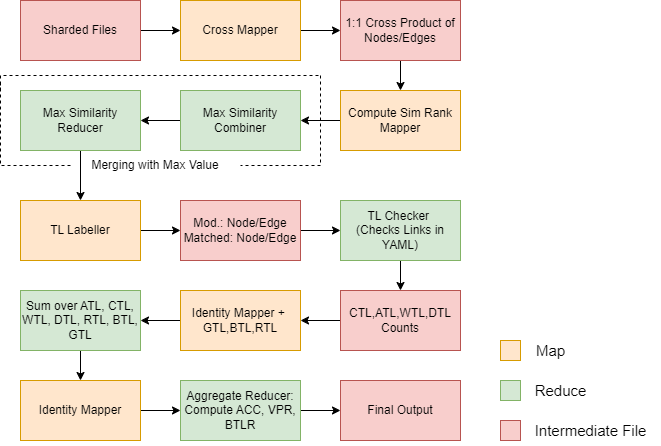

# Documentation

## Table of Contents

- [Documentation](#documentation)
  - [Table of Contents](#table-of-contents)
  - [Usage](#usage)
  - [Details, Explainations and Information](#details-explainations-and-information)
    - [Preprocessing](#preprocessing)
    - [Map Reduce Jobs](#map-reduce-jobs)
  - [Insight](#insight)
- [AWS EMR Deployment](#aws-emr-deployment)

## Usage

- [CrossProductGraphShards](./CrossProductGraphShards.md)
- [ComputeSimRankJob](./ComputeSimRankJob.md)
- [TLLabellerJob](./TLLabellerJob.md)
- [SumJobForStats](./SumJobForStats.md)
- [StatCompute](./StatCompute.md)

## Details, Explainations and Information

### Preprocessing

The above image explains what the preprocessor does. It reads the .ngs and .ngs.perturbed file and makes 2 files shardedNodes and shardedEdges. Theses files contain shards created from the graph. Each line of the output file is a shard. each shard contains: 
- Nodes/Edges from graph 1 seperated by a tab (each shard contains 5% of the nodes/edges from graph 1)
- A seperator delimiter such as "|"
- Nodes/Edges from graph 2 seperated by a tab (each shard contains 5% of the nodes/edges from graph 2)

The preprocessor also replaces tabs with spaces in the yaml file given by netgamesin because the yaml parser we use does not support tabs.

This was made in a submodule because:
- It uses netgamesim.jar as a library, and I was facing difficulties in managing the dependencies for both netgamesim and my map reduce jobs. Easiest way out, the preprocessor is a submodule and has its own sbt file.
- It is a standalone project and can be used by anyone who wants to use netgamesim, to create shards for their own use.

### Map Reduce Jobs

The above image explains the map reduce jobs. The first 3 jobs are used to find the similarity between nodes and edges from the two graphs. The last 2 jobs are used to find the metrics such as ATL,CTL,WTL,DTL,GTL,BTL,RTL,ACC,VPR,BTRL. (as described in the homework description). The project overall has 5 mappers and 4 reducers.

The mappers and reducers are as follows:

- [CrossProductGraphShards](./CrossProductGraphShards.md): This mapper is used to find the cross product of the shards created by the preprocessor. The output of this mapper is a file where each line is a pair of nodes from the two graphs. The output of this mapper is the cross product of the elements original and perturbed graph. This job completes phase 1 of algorithm which is finding cross product of the two graphs.

- [ComputeSimRankMapper](./ComputeSimRankJob.md): This mapper is used to find the similarity of each pair of nodes from the two graphs using a custom SimRank function designed using jaccard similarity. The output of this phase's mapper is a file where each line is a pair of nodes from the two graphs and their similarity score. 

- [ComputeSimRankReducer](./ComputeSimRankJob.md): This reducer which is also a combiner, finds out the maximum similarity score for each key. Basically, this means that for each key (node from graph 1), amongst all the nodes from graph 2, it finds the node with the maximum similarity score. The rest of the TLs are not of interest to us. The output of this phase is a file which contains nodes from graph 1 as keys and their maximum sim score and nodes from graph 2 as keys and their maximum sim score.

- [TLLabellerMapper](./TLLabellerJob.md): This mapper deals with node labelling. We label each node from graph 1 as either matched, modified, or removed based on similarity score. We label each node from graph 2 as removed if their max sim score is below a threshold. The output of this mapper is a file where each line is a node from graph 1 or graph 2 and its label. In this scenario, the matched nodes are the traceability links which are matched and the removed, added and modified nodes the traceability links which are discarded. The output of this job is a key matched/added/removed/modified, node information. A matched node is something which this algorithm says is a tracebility link. A node added,removed,modified is something which this algorithm says is not a traceability link.

- [TLLabellerReducer](./TLLabellerJob.md): In this reducer, we read the golden truth yaml given to us by netgame sim and find out which matched nodes are actual tracebility links, which matched nodes are tracebility links that should have been discarded, which tracebility links that should have been discarded are actual tracebility links and which tracebility links that should be discarded were actually discarded. This done assuming the following logic:
  - If a node is added, modified or removed in the yaml its a tracebilility link that should be discarded.
  - If a node exists in the yaml, its a tracebility link that should be matched.

> The above assumption is crucial in understanding how this program computes ATL, CTL, WTL and DTL. The rest of the metrics are calculate as per description given in the homework. Essentially what the above boils down to is if an (added,modified,removed) prediction exists in the yaml its a true negative (DTL), if a (matched) prediction exists in the yaml its a false positive (WTL), if a (added,modified,removed) prediction does not exist in the yaml its a false negative (ATL) and if a (matched) prediction does not exist in the yaml its a true positive (CTL). (As anything that exists in the yaml is not a tracebility link (negative) and anything that does not exist in the yaml is a tracebility link (positive), because the yaml contains information on the perturbation).

- [SumJobForStatsCombine/SumJobForStatsBiCombine Mapper](./SumJobForStats.md): Its essentially a modified version of an identity mapper that, aggregates to count GTL, BTL and RTL. This is done by writing to context a GTL key anytim a DTL or ATL is encountered, a BTL key anytime a WTL or CTL is encountered and a RTL key always. The output of this mapper is a key GTL/BTL/RTL/CTL/WTL/ATL/DTL and the count (an integer).

- [SumJobForStatsCombine Reducer](./SumJobForStats.md): This reducer finds the sum of values for all the keys. The output of this reducer is a key GTL/BTL/RTL/CTL/WTL/ATL/DTL and the sum of the values for that key. These are the counts of different metrics as described in the homework.

- [StatCompute Mapper](./StatCompute.md): Is an Identity Mapper, writes a key "Metric" with the value as "CTL:(its Count)".

- [StatCompute Reducer](./StatCompute.md): The reducer extracts all tracebility links metrics from the value array received by the only key Metric and computes the accuracy, BLTR and VPR metrics. The output of this reducer is a key "Accuracy" with the value as the accuracy, a key "BLTR" with the value as the BLTR and a key "VPR" with the value as the VPR. These are the metrics as described in the homework.

## Insight 

- The reading of Yaml File by adding it to hadoop context required one var for storing the context information. The class only receives the context during the setup phase and not while it is initialised so a val couldnt have been used. Using this var is neccessary because it makes it possible for the reducer to load the yaml file only once in the setup and not for every reduce function call. A different choice could have led to a different result. 

- The NGS Yaml parser has two options for loading the file one from a normal file system and the other over an http get call, this was done because the job had to access the file from an s3 bucket when it was deployed on aws emr. For the scope of this project a simple bucket policy that allows get on all the files was used however in a professional setting a more secure policy can be deployed.

- The formulation of how to evaluate tracebility links is based on the authors(@kaushal1011) best understanding of the problem we are trying to solved of detecting matching elements and filtering unmatching elements in two graphs such that one is perturbed and other is not. However, depending on details of and other nitty gritty of the problem, the formulation of the evaluation metrics can be different. This would require only the TLLabellerJob and the ComputeSimRank Reducer to change, the rest of the jobs would remain the same.
  - The TLLabeller job mapper and reducers are the only jobs that would need to be changed because it is here that the classification algorithm based on the highest simrank score is written. The reducer computes how ATL,CTL,WTL and DTL are computed.
  - The Reducer of ComputeSimRank may need to change depending on if we want information of comparisons other than the one with the highest simrank score. For example, if we want to know the top 5 comparisons with the highest simrank score, the reducer would need to be changed.
  - The rest of the jobs would remain the same as anything above these jobs computes the cross product and similarity scores of the nodes and edges from the two graphs (something essential to the problem statement and not the formulation of the evaluation metrics). The jobs below the TLLabellerJob compute the metrics as described in the homework description and perform simple operations such as summing and counting using map reduce paradigm. These jobs would not need to be changed.
- All the threshold values in the jobs are read from the application.conf configuration file and all input and output paths are provided as arugments to the jobs.
- There are overall 10 testcases, testing has been done to test out intermediate functions used in the jobs such as node parsers, edge parsers, yaml parsers, similarity comparison and configuration loading.

# AWS EMR Deployment

- These jobs were deployed on an EMR 6.0.0 cluster. The cluster has 3 machines each running on an ec2 m4large instance. There were 8 jobs configured overall considering the comparison was made on both nodes and edges. The jobs steps provided input and output paths and some flags for the job classes. Rest of the information has been configured in the application.conf.

